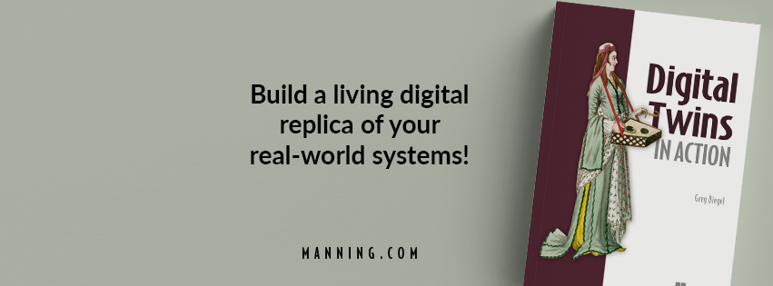

<!-- # Digital Twins in Action -->

This repository contains the code samples referenced in the book [Digital Twins in Action](https://www.manning.com/books/digital-twins-in-action), together with instructions on how to run them.

- [Chapter 2 - Mapping physical systems to a digital representation](code/ch02/README.md)
- [Chapter 3 - Sensing the real world ](code/ch03/README.md)
- [Chapter 4 - Data integration and management ](code/ch04/README.md)
- [Chapter 5 - Modeling reality ](code/ch05/README.md)
- [Chapter 6 - Visualizing the digital world ](code/ch06/README.md)
- [Appendix B - Building a custom IoT sensor ](code/appendixb/README.md)
