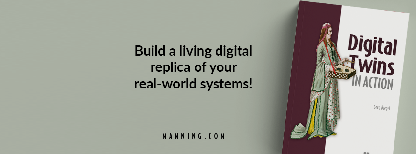

<!-- # Digital Twins in Action -->

This repository contains the code samples referenced in the book [Digital Twins in Action](https://www.manning.com/books/digital-twins-in-action), together with instructions on how to run them.

- [Chapter 2 - Mapping physical systems to digital representations ](code/ch02/README.md)
- [Chapter 3 - Sensing the real world ](code/ch03/README.md)
- [Chapter 4 - Data integration and management ](code/ch04/README.md)
- [Chapter 5 - Modeling reality ](code/ch05/README.md)
- [Chapter 6 - 2D visualization and insight ](code/ch06/README.md)
- [Chapter 7 - Spatial context and 3D insight ](code/ch07/README.md)
- [Chapter 8 - Integrating inference and intelligence ](code/ch08/README.md)
- [Chapter 9 - Predicting outcomes with simulation ](code/ch09/README.md)
- [Chapter 10 - Digital twins in production](code/ch10/README.md)
- [Appendix A - Building a LoRaWAN network ](code/appendixa/README.md)
- [Appendix B - Building a custom IoT sensor ](code/appendixb/README.md)
- [Appendix C - Building a 3D model from photogrammetry ](code/appendixc/README.md)
