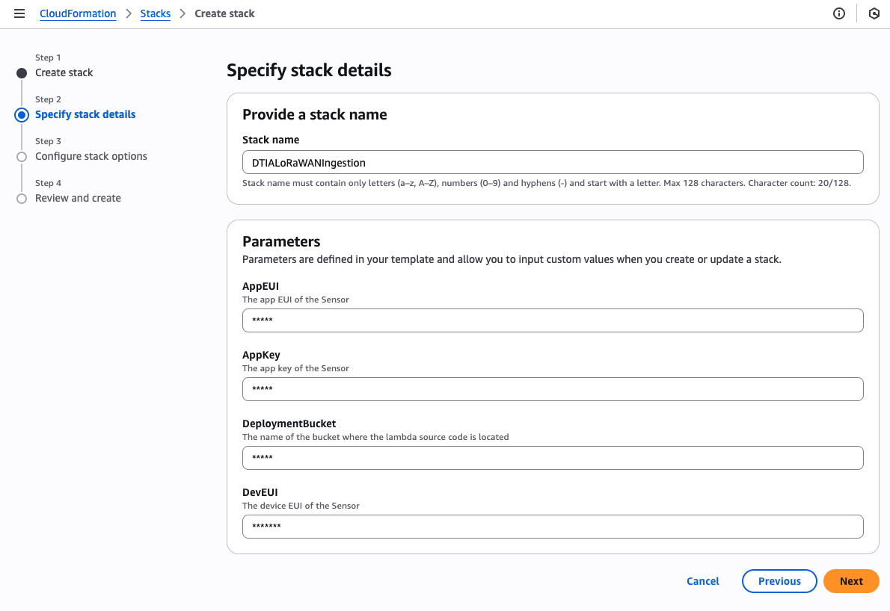

# Digital Twins in Action

## Appendix A - Building a LoRaWAN network
In this repository you will find the complete code samples from Appendix A of Digital Twins in Action where you learn how to build a private LoRaWAN network based on AWS IoT Core for LoRaWAN.

### Deploying the LoRa Sensor and collection hub code
There is a CloudFormation stack in the following file that will set up the LoRaWAN network referenced in Chapter 3 of the book, and described in detail in Appendix A:

`lorawan_cfn.yml`

This CloudFormation stack will create the following resources in AWS:

- An AWS IoT Core for LoRaWAN Device Profile
- An AWS IoT Core for LoRaWAN Service Profile
- An AWS IoT Core for LoRaWAN LoRaWAN Wireless Device
- An AWS IoT Core for LoRaWAN Destination
- An AWS IoT Topic rule
- A message decoder Lambda function
- Two Identity and Access Management roles

### Pre-requisites
Before deploying this CloudFormation stack you will need:-

- Access to an AWS account with permission to deploy CloudFormation stacks.
- A physical LoRaWAN gateway (I use this one https://www.dragino.com/products/lora-lorawan-gateway/item/244-lg01v2.html) that has been configured in AWS IoT Core for LoRaWAN as described in Appendix A of the book.
- A LoRaWAN sensor that uses over the air activation (OTAA) e.g. this Dragino indoor temperature / humidity sensor https://www.dragino.com/products/temperature-humidity-sensor/item/199-lht52.html
- An S3 bucket in your AWS account where you can upload the Lambda function code (the deployment bucket).

### Preparing the Lambda function code
After you have made any modifications to the Lambda function code (for example to implement a decoder function for your specific LoRaWAN sensor payload), you must zip it up with the following command

```
zip message_decoder_lambda.zip message_decoder.py
```
Then upload the `message_decoder_lambda.zip` file to your S3 bucket.

### Deploying the CloudFormation stack
To deploy the stack, in the AWS console navigate to CloudFormation -> Stacks -> Create stack and enter the the AppEUI, AppKey, DevEUI, and Deployment bucket values for your sensor and Lambda code as shown below.

