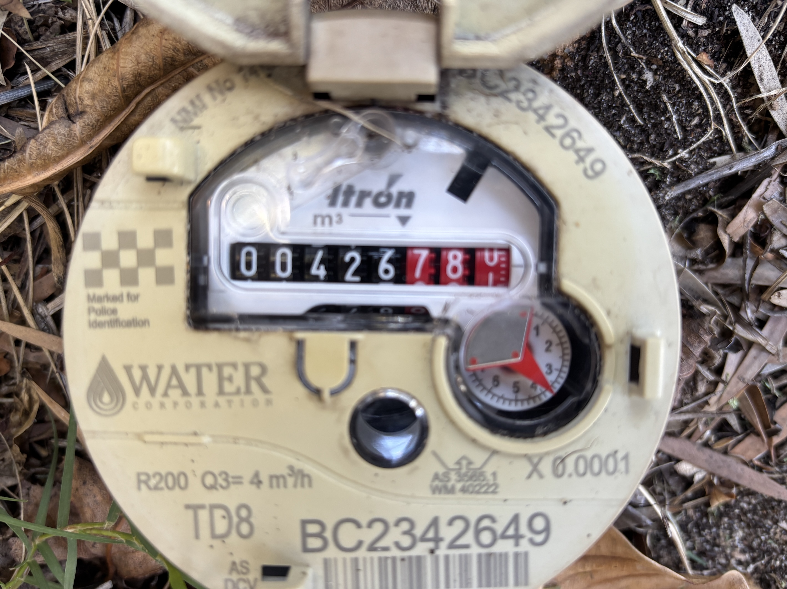
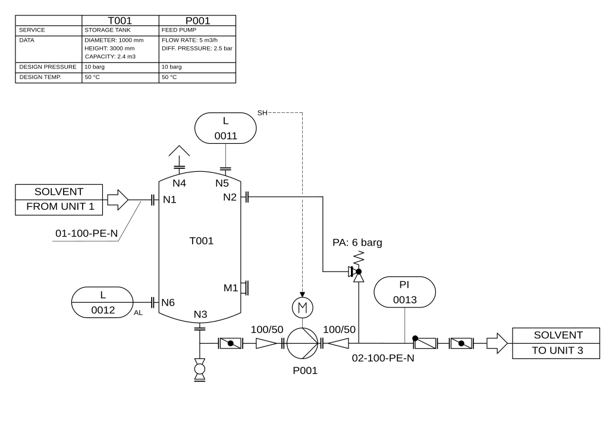
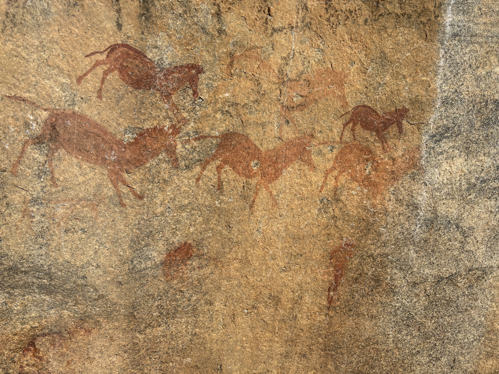

# Digital Twins in Action

## Chapter 2 - Mapping physical systems to a digital representation - code samples
In this repository you will find the complete code samples from Chapter 2 of Digital Twins in Action where you learn how you can map physical objects to digitial representations, using techniques such as OCR, multi object recognition, image-capable LLMs, and coordinate reference systems.

### Preparing to run the code
The samples are all written in Python. Some of the sample code uses example data also found in this repository. 
To run the code, you will need a version of Python 3 installed on your system - the code has been tested with the latest release at the time of writing (3.13.7). Installers for Python are available from the Python website at https://www.python.org/. 

I recommend using the *virtualenv* tool to create an isolated Python environment in which to run the code and isolate dependencies from your main Python installation. Since Python 3.3 a subset of virtualenv, known as *venv* has been integrated into the standard library.

To create a virtual environment named *dtia_ch02*, type the following command:

`python3 -m venv dtia_ch02`

You can then activate the virtual environment by typing the following command

`source dtia_ch02/bin/activate`

The libraries that are required to run the chapter 2 code samples are defined in the requirements.txt file in this directory. To install the required libraries in your virtual environment, run the following command

`pip install -r requirements.txt`

You are now ready to run the code samples and adapt them to your own use case!

#### 2.1 Using OCR to extract a meter reading from a paper bill
This code uses Tesseract to extract a meter reading from this gas bill

Before you run this example, you will need Tesseract installed on your computer - go to https://tesseract-ocr.github.io/tessdoc/Installation.html to get the installation instructions.

To run this example, execute the following command

`
python ch02_code01_biegel.py
`

#### 2.2 Using OCR to extract a meter reading from an image of an analog meter
This code uses Tesseract to extract a meter reading from this photograph

To run this example, execute the following command

`
python ch02_code02_biegel.py
`

#### 2.3 Multiple object detection in a video stream
You will need a webcam on your computer to try this example (the built in one will work fine). If you have any trouble, you may need to change the index of the Webcam on line 11 (more details here https://docs.opencv.org/4.x/dd/d43/tutorial_py_video_display.html)

To run this example, execute the following command.

`
python ch02_code03_biegel.py
`

#### 2.4 Transform a PID to JSON using Anthropic Claude LLM
You will need a key to the Anthropic API to run this example, which you can get here https://docs.anthropic.com/en/home. If you don't have an API key, the next file contains the output of running this code. 

The code uses an LLM to convert this PID diagram to a structured JSON representation

To run this example, execute the following command

`
python ch02_code04_biegel.py -k <your_api_key>
`

#### 2.5 Output of 2.5
The following file contains the output of running the previous code. Since the output of the LLM is non-deterministic, you can compare the output you get by running the code against other LLMs, or using a different prompt, with that which I got from Claude and the simple prompt used in the code.

`
ch02_code05_biegel.json
`

#### 2.6 Extract geographical coordinates from an image
To run this example, execute the following command to see where in the world the image of the rock paintings was taken.

`
python ch02_code06_biegel.py images/rockPainting.jpg
`

#### 2.7 Transform local coordinates to projected global coordinates 
This example projects local coordinates to a location in the real world.

To run this example, execute the following command. See if you can work out where in the world I have placed my square! 

`
python ch02_code07_biegel.py
`

#### 2.8 Transform projected UTM coordinates to latitude and longitude
This code uses the PROJ library to show how simple coordinate transformation can be.

To run this example, execute the following command

`
python ch02_code07_biegel.py
`