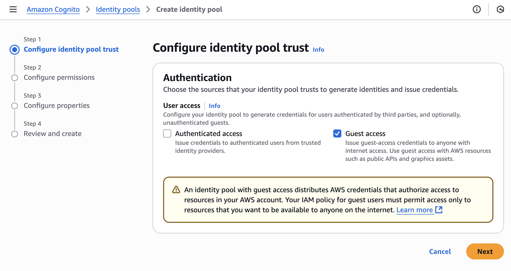
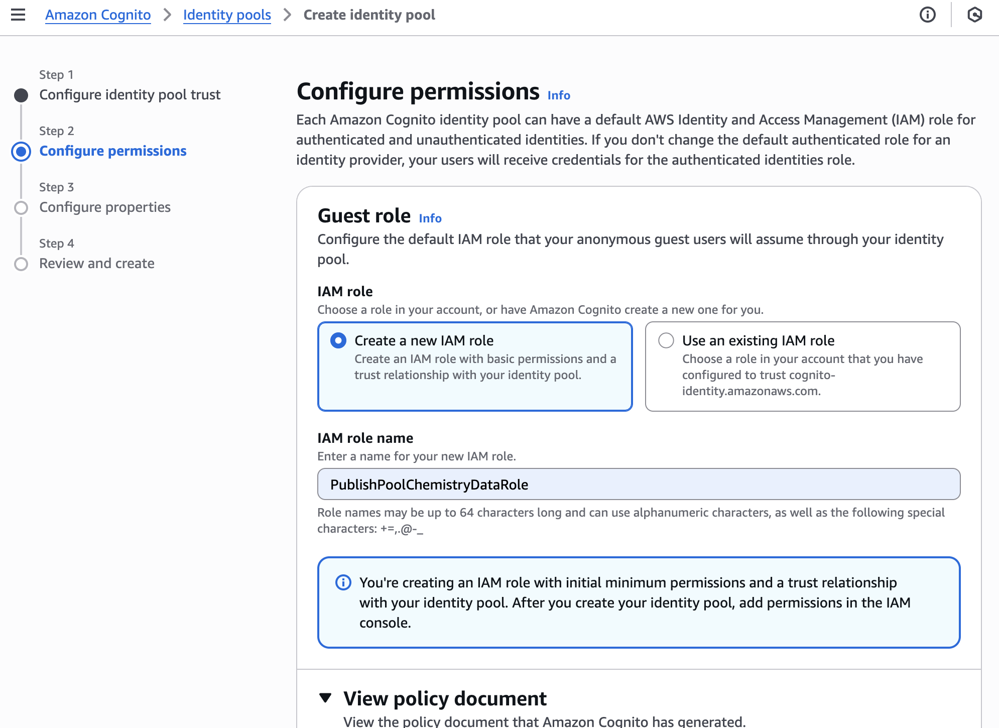
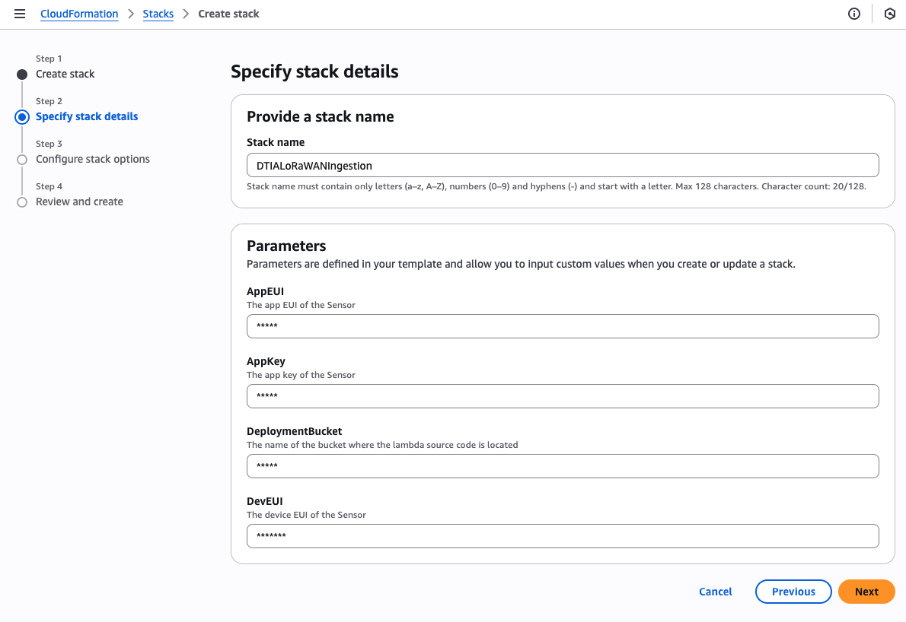

# Digital Twins in Action

## Chapter 3 - Sensing the real world - code samples
In this repository you will find the complete code samples from Chapter 3 of Digital Twins in Action where you learn about sensing changes in the physical world to keep your digital representation updated with changes.

### Preparing to run the code
The samples are written in Python, HTML, and AWS CloudFormation. Some of the sample code uses example data also found in this repository. 
To run the Python code, you will need a version of Python 3 installed on your system - the code has been tested with the latest release at the time of writing. Installers for Python are available from the Python website at https://www.python.org/. 

I recommend using the *virtualenv* tool to create an isolated Python environment in which to run the code and isolate dependencies from your main Python installation. Since Python 3.3 a subset of virtualenv, known as *venv* has been integrated into the standard library.

To create a virtual environment named *dtia*, type the following command:

`python3 -m venv dtia`

You can then activate the virtual environment by typing the following command

`source dtia/bin/activate`

The libraries that are required to run the code samples (including OCR and computer vision libraries) are defined in the requirements.txt file included in the books GitHub repository. To install the required libraries in your virtual environment, run the following command

`pip install -r requirements.txt`

You are now ready to run the code samples and adapt them to your own use case!

#### 3.1 Analog to digital conversion example
This example shows how an analog to digital convertor takes a continuously varying voltage from a capacitive sensor, and converts it into a digital value.

To run this example, execute the following command

`
python ch03_code01_biegel.py
`

#### 3.2 MQTT publish and subscribe example
This example shows how you can publish messages to an MQTT broker, and subscribe to messages from the broker. It uses a publically available broker that anyone can acess. Try subscribing to the topic `#` to see a bunch of data people all over the world are publishing to this broker.

To run this example, execute the following command

`
python ch03_code02_biegel.py
`

#### 3.3 Manual data collection and publication to MQTT example
This example shows how you can use a simple web page to collect data about the physical environment manually and publish it to MQTT in the cloud. It does require a couple of things to be set up within AWS first (to enable you to push data to IoT core).

For demonstration purposes, I am using a Cognito Identity Pool with anonymous access, but for anything other than a demonstration, you should integrate authentication with your identity provider and ensure authenticated access. To configure a Cognito Pool for guest access, navigate to Amazon Cognito -> Identity Pools -> Create identity pool and check **Guest access** and **Next**.



In the permissions screen, create a new IAM role and give it permission to only publish to the MQTT topic your data will be posted to 


An example of the IAM policy document is shown that, when your identity pool ARN and IoT core topic ARN are substituted will allow anonymous posting of messages to the topic.

```
{
    "Version": "2012-10-17",
    "Statement": [
        {
            "Effect": "Allow",
            "Action": [
                "cognito-identity:GetCredentialsForIdentity"
            ],
            "Resource": [
                "<your_identity_pool_arn>"
            ]
        },
        {
            "Effect": "Allow",
            "Action": [
                "iot:Publish"
            ],
            "Resource": "<your_topic_arn>"
        }
    ]
}
```

To run this example update the parameters in the HTML file and then open it with a web browser (such as Chrome)

`
ch03_code03_biegel.html
`


#### 3.4 Message decoding example
This example shows how an encoded message from a LoRaWAN temperature and humidity sensor (the [LHT52](https://www.dragino.com/products/temperature-humidity-sensor/item/199-lht52.html)) can be decoded to extract the vtemperature and humidity values based on the protocol encoding in the sensor [manual](https://wiki.dragino.com/xwiki/bin/view/Main/User%20Manual%20for%20LoRaWAN%20End%20Nodes/LHT52%20-%20LoRaWAN%20Temperature%20%26%20Humidity%20Sensor%20User%20Manual/).

To run this example, execute the following command

`
python ch03_code04_biegel.py
`

## Deploying the LoRa Sensor and collection hub code
There is a CloudFormation stack in the following file that will set up the LoRaWAN network referenced in Chapter 3 of the book, and described in detail in Appendix A:

`ch03_code00_biegel.yml`

This CloudFormation stack will create the following resources in AWS:

- An AWS IoT Core for LoRaWAN Device Profile
- An AWS IoT Core for LoRaWAN Service Profile
- An AWS IoT Core for LoRaWAN LoRaWAN Wireless Device
- An AWS IoT Core for LoRaWAN Destination
- An AWS IoT Topic rule
- A message decoder Lambda function
- Two Identity and Access Management roles

## Pre-requisites
Before deploying this CloudFormation stack you will need:-

- Access to an AWS account with permission to deploy CloudFormation stacks.
- A physical LoRaWAN gateway (I use this one https://www.dragino.com/products/lora-lorawan-gateway/item/244-lg01v2.html) that has been configured in AWS IoT Core for LoRaWAN as described in Appendix A of the book.
- A LoRaWAN sensor that uses over the air activation (OTAA) e.g. this Dragino indoor temperature / humidity sensor https://www.dragino.com/products/temperature-humidity-sensor/item/199-lht52.html
- An S3 bucket in your AWS account where you can upload the Lambda function code (the deployment bucket).

## Preparing the Lambda function code
After you have made any modifications to the Lambda function code (for example to implement a decoder function for your sepcific LoRaWAN sensor payload), you must zip it up with the following command

```
zip lambda.zip message_decoder.py
```
Then upload the `lambda.zip` file to your S3 bucket.

## Deploying the CloudFormation stack
To deploy the stack, in the AWS console navigate to CloudFormation -> Stacks -> Create stack and enter the the AppEUI, AppKey, DevEUI, and Deployment bucket values for your sensor and Lambda code as shown below.

