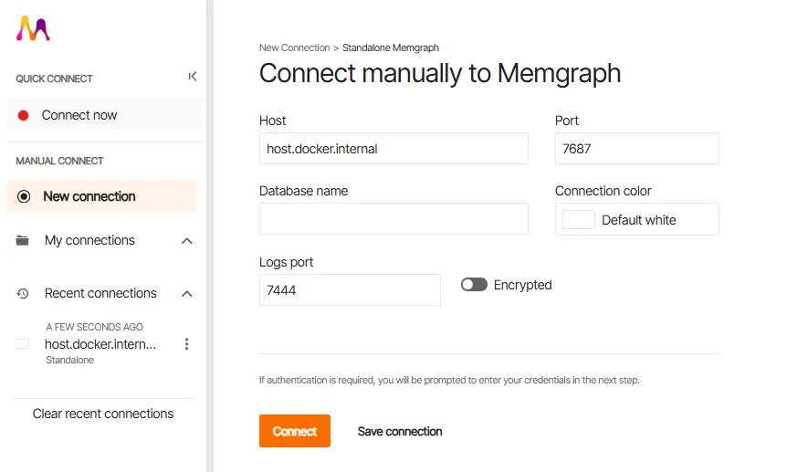
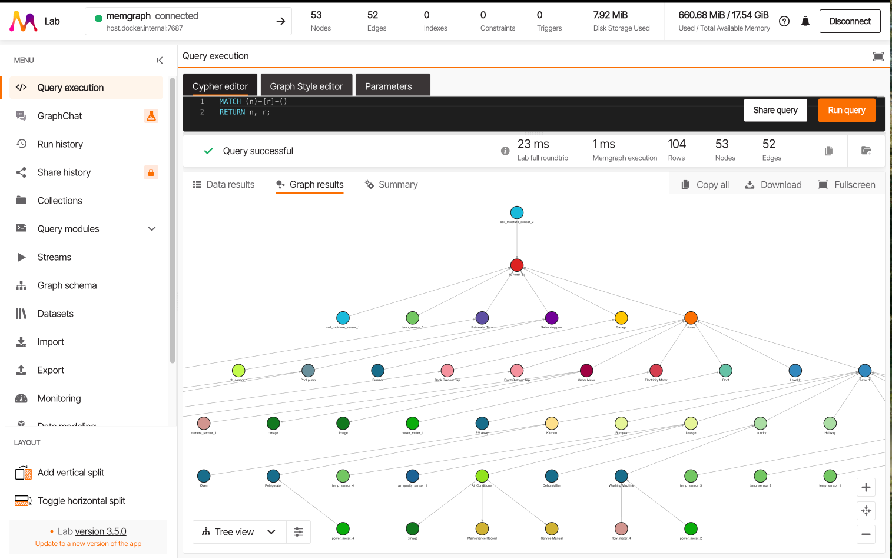
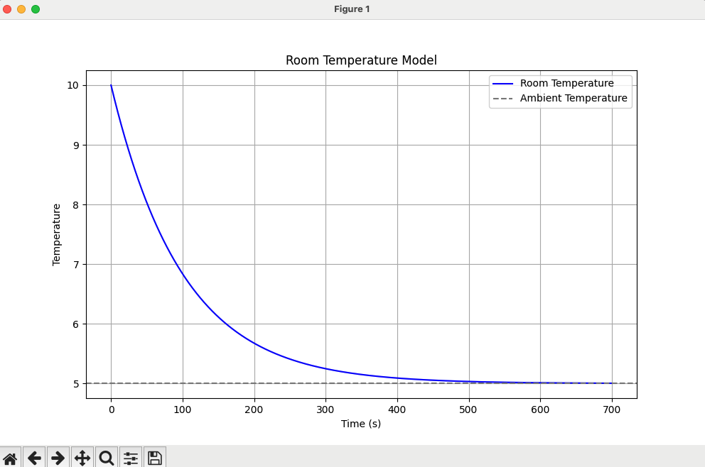

# Digital Twins in Action

## Chapter 5 - Modelling reality - code samples
In this repository you will find the complete code samples from Chapter 5 of Digital Twins in Action where you learn how to build a digital model of reality.

### Preparing to run the code
The samples are all written in Python. Some of the sample code uses example data also found in this repository. 
To run the code, you will need a version of Python 3 installed on your system - the code has been tested with the latest release at the time of writing (3.13.7). Installers for Python are available from the Python website at https://www.python.org/. 

I recommend using the *virtualenv* tool to create an isolated Python environment in which to run the code and isolate dependencies from your main Python installation. Since Python 3.3 a subset of virtualenv, known as *venv* has been integrated into the standard library.

To create a virtual environment named *dtia_ch05*, type the following command:

`python3 -m venv dtia_ch05`

You can then activate the virtual environment by typing the following command

`source dtia_ch05/bin/activate`

The libraries that are required to run the chapter 5 code samples are defined in the requirements.txt file in this directory. To install the required libraries in your virtual environment, run the following command

`pip install -r requirements.txt`

You are now ready to run the code samples and adapt them to your own use case!

#### 5.1 Example of fuzzy matching string identifiers
This example uses the [fuzzwuzz](https://github.com/seatgeek/thefuzz) library to fuzzily match identifiers. Matching identifiers between data sets is a commonly used mechanism for data contextualization.

To run this example, execute the following command

`
python ch05_code01_biegel.py
`

#### 5.2 Example DTDL file
This example contains a very simple JSON-LD file DTDL file to gove you a sense of the Digital Twin Definition Language.

#### 5.3 Example of building a simple knowledge graph in Memgraph
This example shows how you can build the simple knowledge graph of the thermostat in the hotel room shown in the book using [Memgraph](https://memgraph.com/).

Before running the code, ensure you are running Memgraph locally by running the following command:

`
docker run -p 7687:7687 -p 7444:7444 --name memgraph memgraph/memgraph-mage
`

To run this example, execute the following command

`
python ch05_code03_biegel.py
`

Once you have confirmed that this code is working (meaning the server is running and you can connect to it), you can then load the Knowledge Graph of the home digital twin, by running the following command:

`
python load_home_kg.py
`

You can run the Memgraph Lab container if you want to connect to your graph database and run queries and view the output visually with this command. This will create the graph as shown in the book, and run a traversal to get the battery percentage of the thermostat.

`
docker run -d -p 3000:3000 --name lab memgraph/lab
`

The Memgraph lab provides a rich user interface for you to browse and manipulate the data in the graph. Once the Cocker container is running, you can access this interface at http://localhost:3000. To connect to your Memgraph server, choose new connection and enter the address `host.docker.internal` as shown in the following image.



To view the home Knowledge graph, you can run this Cypher query in the lab to show all nodes and edges in the graph:

`
MATCH (n)-[r]-()
RETURN n, r;
`



#### 5.4 Run a simple home thermal physics model
This example shows a simple example of using a mathematical equation to model the thermal properties of a room in the house. It plots the output of the temperature change over time.

To run this example, execute the following command

`
python ch05_code04_biegel.py
`

You should get the following output



#### 5.5 Run a GraphQL API
This example runs the simple GraphQL API shown in the book that orchestrates calls to a geocoding API and the Open Meteo API to retrieve a 7 day weather forecast for a given city.

To run this example, execute the following command

`
python ch05_code05_biegel.py
`

This will start the API. You can then run queries on the API using the cURL command (or any mechanism that can send a POST request).

Here is a sample command to get the weather forecast for Perth:

```
curl -X POST http://127.0.0.1:5000/graphql \
  -H "Content-Type: application/json" \
  -d '{
    "query": "{ weather(city: \"Perth\") { time rain surfaceTemperature } }"
  }'
```

Once you've run that successfully, you can move on to run the full digital twin GraphQL API as follows:

The full GraphQL API that I have created for my home digital twin is available in the following file:-

`
digital_twin_api.py
`

This API orchestrates calls to the knowledge graph running in Memgraph, and then onto my timeseries data store in DynamoDB. You can run all this locally.

First of all, make sure you are running DynamoDB locally and have loaded the sensor data as described in [Chapter 4](../ch04/README.md) (section 4.10).

Then, run the full home Digital Twin GraphQL API with the following command:

`
python digital_twin_api.py
`

Once you have the home API running, you can query it by POSTing data to the endpoint - an example query is shown below:

```
curl -X POST http://127.0.0.1:5000/graphql \
  -H "Content-Type: application/json" \
  -d '{
    "query": "{ spaces(space: \"10 North St.\", startDate: \"2025-09-01T00:00:00Z\", endDate: \"2025-09-02T00:00:00Z\") { name measurements {name values {timestamp value}}} }"
  }'
```

In [Chapter 6](../ch06/README.md), you will call this GraphQL API from an HTML page to render the data.

#### 5.6 Asset administration shell
Running the following file will retrieve and print all available Asset Administration Shells from the API discussed in the book:

`
python ch05_code06_biegel.py
`