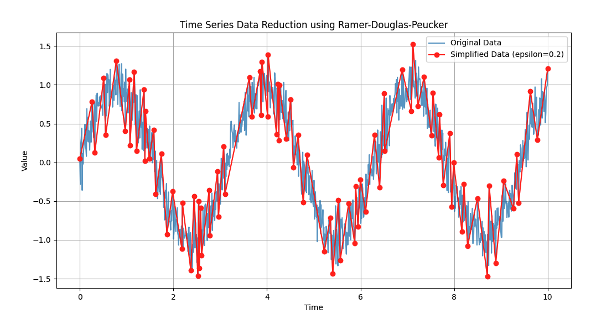
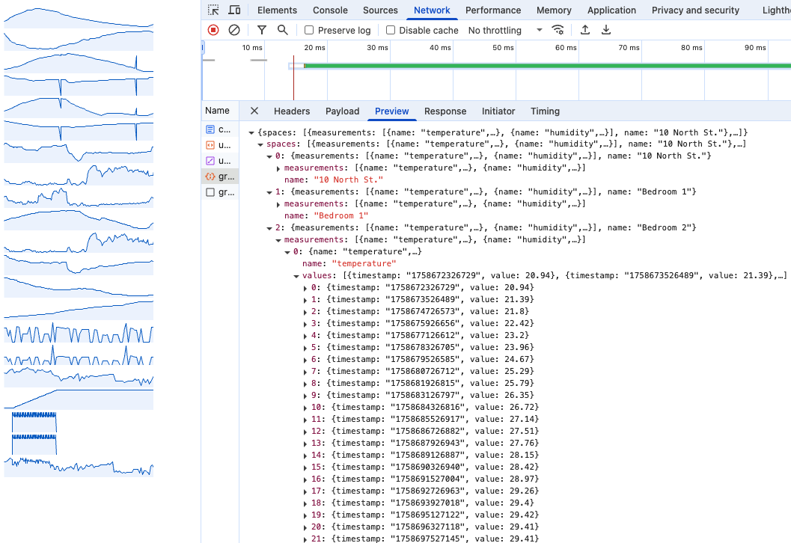
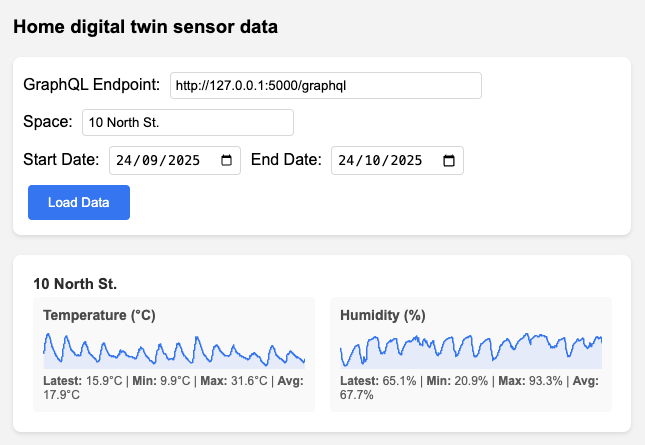

 
# Digital Twins in Action

## Chapter 6 - Data visualization and dashboards - code samples
In this repository you will find the complete code samples from Chapter 6 of Digital Twins in Action where you learn how to visualize data through 2D visualizations - charts and dashboards.

### Preparing to run the code
The backend code samples are all written in Python, whilst the frontend code is in HTML and JavaScript. Some of the sample code uses example data also found in this repository. 
To run the code, you will need a version of Python 3 installed on your system - the code has been tested with the latest release at the time of writing (3.13.7). Installers for Python are available from the Python website at https://www.python.org/. 

I recommend using the *virtualenv* tool to create an isolated Python environment in which to run the code and isolate dependencies from your main Python installation. Since Python 3.3 a subset of virtualenv, known as *venv* has been integrated into the standard library.

To create a virtual environment named *dtia_ch06*, type the following command:

`python3 -m venv dtia_ch06`

You can then activate the virtual environment by typing the following command

`source dtia_ch06/bin/activate`

The libraries that are required to run the chapter 6 code samples are defined in the requirements.txt file in this directory. To install the required libraries in your virtual environment, run the following command

`pip install -r requirements.txt`

You are now ready to run the code samples and adapt them to your own use case!

#### 6.1 Ramer-Douglas-Peucker (RDP) algorithm to decimate timeseries data 
This example shows how you can use the Ramer-Douglas-Peucker (RDP) algorithm to decimate timeseries data for effectively showing graphs of large numbers of data points.

Run it with the following command

`
python ch06_code01_biegel.py
`

You will see a graph showing the original data overlaid with the decimated data as below. Try varying the epsilon value and running again.

#### 6.2 Other example files
There are some other example files from Chapter 6 as follows:

- *uPlot graph example as shown in figure 6.2* - the file [here](ch06_code_uplotbands.html) displays the uPlot graph example in Chapter 6. Open it in a web browser like Chrome to view it.

- *Sparklines of all data from home digital twin as described in section 6.2.1* - first of all make sure you have the digital twin GraphQL API running on on 127.0.0.1:6000 as described [here](../ch05/README.md) and then open the file [here](ch06_code_sparklines.html) in a web browser like Chrome to view it. This page simply gets all sensor data, and graphs it - very simple. Look in the browser dev tools to see the network call made to the GraphQL API as shown below

- *Dashboard as shown in figure 6.3* - first of all make sure you have the digital twin GraphQL API running on on 127.0.0.1:5000 as described [here](../ch05/README.md) and then open the file [here](ch06_code_dashboard.html) in a web browser like Chrome to view it. You should see the view below:

## 6.3 Grafana dashboard
Full instructions on how to run the Grafana dashboard and the API to serve data to it are available [here](./grafana_dashboard/README.md).